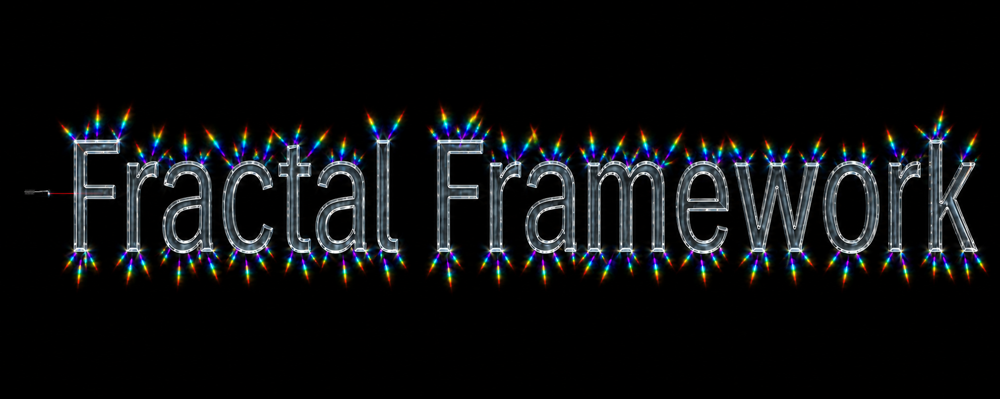
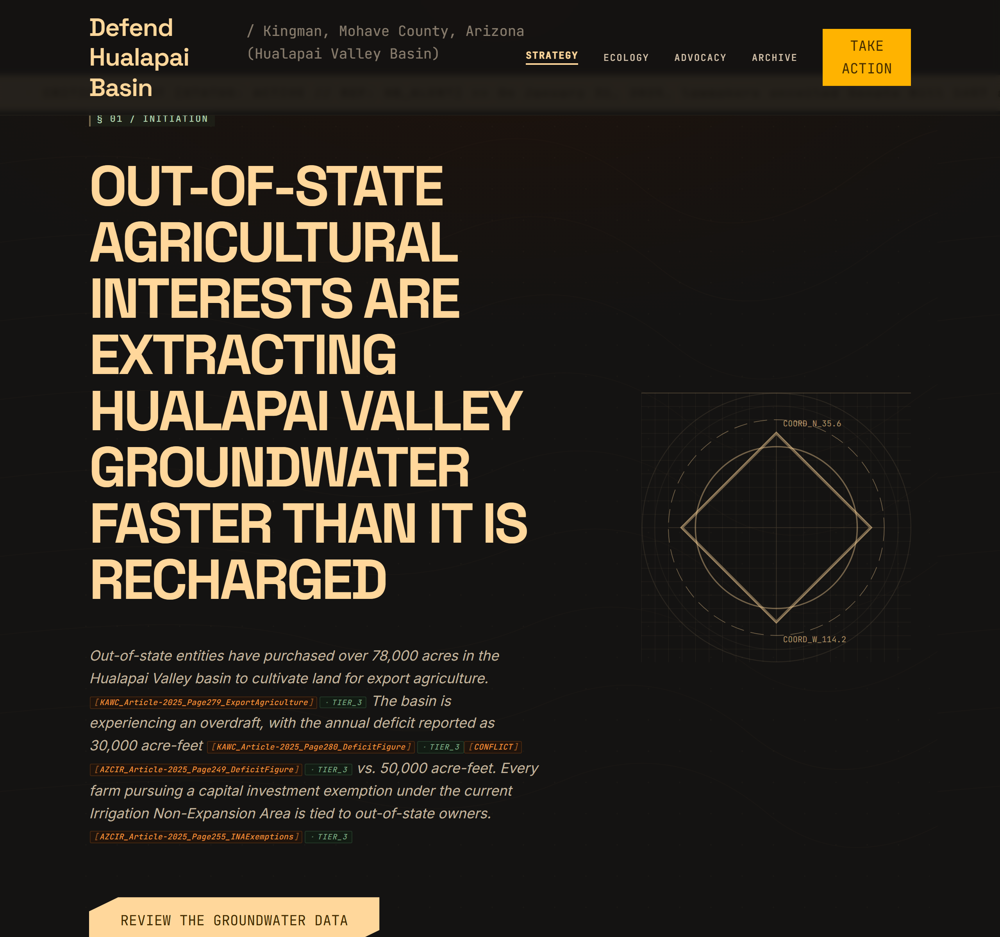
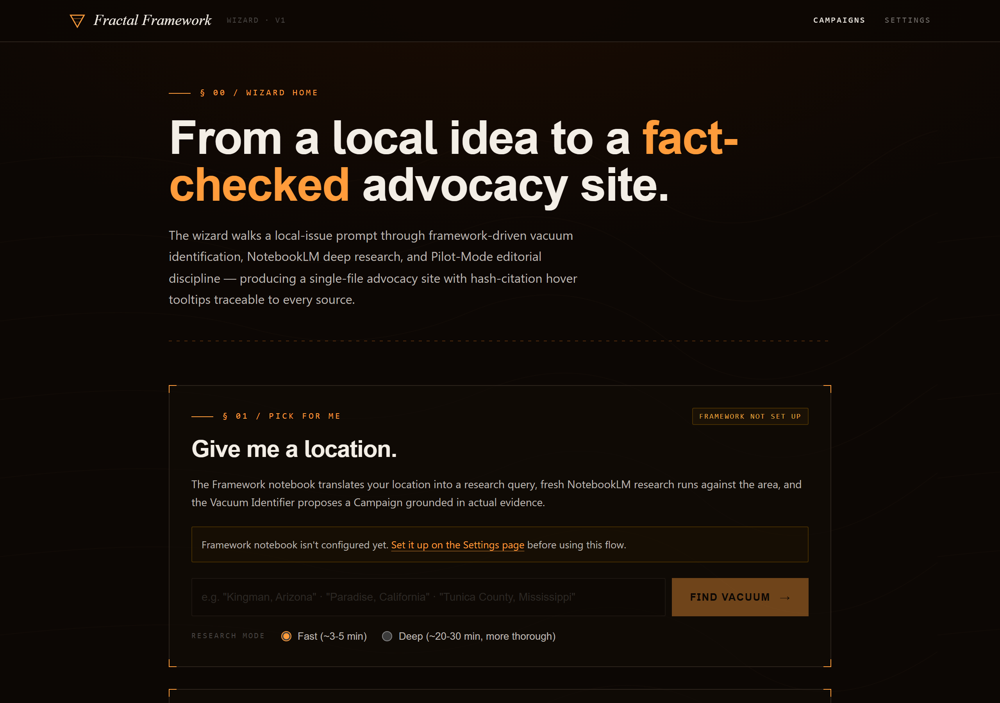
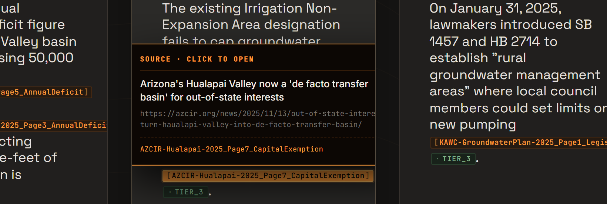

# Fractal Framework

## What is this?

**Fractal Framework is an experimental wizard that helps anyone turn a
real local problem into a source-cited advocacy website without needing
to be a researcher, a designer, or a developer.**

You simply give it a place, and it conducts the research, writes the
site, and keeps source citations beside the factual claims it generates
so you can inspect them yourself.



*A generated site about Hualapai Valley groundwater depletion, with
inline citations linked to source documents.*

---

## Who this is for

- **A student** who's watching something go wrong in your community —
  whether it's the water table, an aquifer, or a reservoir dropping, the
  school being underfunded, a local trail being paved over, or another
  "activism vacuum" — and wants to do something about it but doesn't know
  exactly where to start.
- **An educator** looking for a project that gives students a real-world
  deliverable they can show their family and put on the web.
- **A volunteer or adult advocate** who cares a lot about a local issue but
  simply doesn't have the time, technical skill, or design palette to
  single-handedly design a website that's ready to take on the issue.
- **Anyone** who's simply tired of low-quality AI-generated content
  flooding the internet on topics they care about, and wants websites
  designed with actual editorial discipline and a visible source trail.

---

## What it actually does

You type a location into the wizard — say, *"Kingman, Arizona"* — or just
your hometown.

The wizard then:

1. **Identifies the local issue worth working on.** A research agent loaded
   with the framework's methodology looks at your location, conducts
   in-depth research, and proposes the most urgent neglected issue
   ("activism vacuum") affecting that place right now. It explains its
   reasoning and shows you which sources it drew from.
2. **Lets you review and edit before locking anything in.** The proposal
   is not treated as final. You can question the reasoning, redirect the
   issue, sharpen the framing, ask for a different direction, or start
   over. The campaign does not move forward until you approve the
   direction.
3. **Runs deep research against trusted sources** to produce the campaign
   content — a hero pitch, key facts, an about essay, what's at stake if
   nothing changes, ways for readers to help, and a full bibliography.
4. **Carries citations into the site.** Hash citations from the research
   output stay beside the claims they support. When a citation resolves to
   a source URL, its chip shows the source title and opens the document.
5. **Optionally designs the visuals** using Google Stitch. The wizard
   validates Stitch's output at every pass to ensure that no citation is
   paraphrased, summarized, or dropped.
6. **Hands you a single HTML file** you can drop on any free static host —
   Cloudflare Pages, GitHub Pages, or another service — or open locally to
   see your finished product.

The wizard and its project files run locally on your computer. Research
and optional visual design use the online services you configure.



### See it in action

The [public Fractal Framework showroom](https://fractal.scootsolute.org/)
replays a prepared example of the project's actual workflow. It shows how
a location becomes a research question, how sources stay attached to
claims, and where a person reviews the result before publication — with no
local setup or live model call required.

### Why this is different from "AI writes a website for me"

Most AI-generated content fails for a simple reason: you cannot verify its
claims. The writing can sound confident even when facts are paraphrased
incorrectly, hallucinated, or linked to sources that do not exist.

Fractal Framework addresses that by:

- **Preserving the citation trail.** Hash citations from the research stay
  in the generated page. When source resolution succeeds, a token like
  `[WRRC_Mohave_County_Page20_AquiferDeficit]` links to a document from the
  campaign's NotebookLM source set.
- **Using source quality tags.** Government records, established
  journalism, and weaker sources are marked separately so readers can
  judge the evidence for themselves.
- **Running a validation gate on the visuals.** If the visual designer
  drops or changes a citation while designing the page, that pass is
  rejected and tried again.
- **Keeping a research record you can inspect.** Research queries, sources,
  and responses are logged so someone can retrace how the site was built.



*A citation tooltip showing the source document's title, URL, and key.*

### What an "activism vacuum" is

A core idea of the framework, in plain terms:

In every county in the United States, there's at least one issue area
where all five of these are true:

- The problem is real (not invented, not exaggerated).
- The current response is inadequate (regulators are absent, asleep, or
  outmatched).
- Community awareness is low (most residents don't know about it).
- The regulatory framework is weak (laws don't cover it, or aren't
  enforced).
- The resources to fix it are within reach (it's not "we need a billion
  dollars" — it's "we need people to know").

These are activism vacuums. They're the places where one well-built
campaign can actually move the needle, because nobody else is paying
attention. The framework helps you find one in your own community and
build the kind of legible, defensible public-facing site that lets others
see what you see.

---

## Running it locally

> **Current requirement:** this is a local source application. You need to
> download or clone it, install its dependencies, and connect the external
> research services you want to use.

For Windows, the recommended starting point is the
[v1.1.0 release](https://github.com/anitacigawet/fractal-framework/releases/tag/v1.1.0).
Download the runnable Windows source ZIP from **Assets**, extract it, and
open the extracted folder. Cloning the repository is the alternative if
you use Git or want the current `main` branch instead of the versioned
release.

### What you'll need

- A computer running Windows, macOS, or Linux.
- [Node.js](https://nodejs.org) 22+ and [pnpm](https://pnpm.io/installation).
- Python 3.11+ for the research engine.
- A Google account for the external NotebookLM research service.
- Your own API key for one external LLM provider — Google Gemini, OpenAI,
  or DeepSeek.
- *Optional:* a Google Stitch API key, if you want AI-generated per-campaign
  visual design through that external service.

### Steps

Open PowerShell in the extracted release folder. If you prefer Git, clone the
repository first and run the same commands from the cloned folder.

```powershell
# Optional alternative to the release ZIP
git clone https://github.com/anitacigawet/fractal-framework.git
Set-Location fractal-framework

# Install the wizard dependencies from the locked versions
Set-Location wizard
pnpm install --frozen-lockfile

# Install the research engine's Python dependencies
Set-Location ../engine/notebooklm_bridge
py -m pip install -r requirements.txt
py -m playwright install chromium

# Authenticate to the external NotebookLM service once
notebooklm login

# Create your local settings file
Set-Location ../../wizard
Copy-Item .env.example .env

# Build and run the wizard
pnpm build
pnpm start
```

Open `http://127.0.0.1:7101` in your browser. Add your API keys via
the Settings page, click *"Set up Framework Notebook,"* and you're ready
to try the *"Pick for me"* flow with a location.

On Windows, you can instead double-click `Launch_Wizard.bat` from the release
root after installing the Python requirements and authenticating NotebookLM.
It installs the locked Node dependencies, verifies the bridge, builds the app,
and opens one local wizard process. Run `Launch_Wizard.bat /verify` from
Command Prompt if you want the checks without opening the wizard.

---

## ⚙️ Extreme technicals below

### Limits

The generated site preserves hash citations from the research and tries
to resolve each one to a source URL. A citation can remain unresolved, and
a linked source can still be wrong or misrepresented. Check each claim
against its source before publishing.

### How this repository is organized

- **`wizard/`** — the local React application and its server.
- **`engine/`** — the Python bridge and prompt files used to work with
  NotebookLM.
- **`docs/`** — the methodology files loaded by the wizard, plus the images
  shown in this README.
- **`Launch_Wizard.bat`** — the Windows launcher.

For the methodology, start with
[`docs/fractal_framework_methodology_guide.md`](docs/fractal_framework_methodology_guide.md).

### Credits

Fractal Framework was developed using Arizona groundwater campaigns as
working examples. The wizard interface includes a human-directed design
created with Claude.ai. Optional campaign-specific visual generation uses
Google Stitch.

### License

Fractal Framework is source-available under the
[PolyForm Noncommercial License 1.0.0](LICENSE). You can study, modify,
and redistribute it for noncommercial purposes under the license terms.
Commercial use is not granted.
